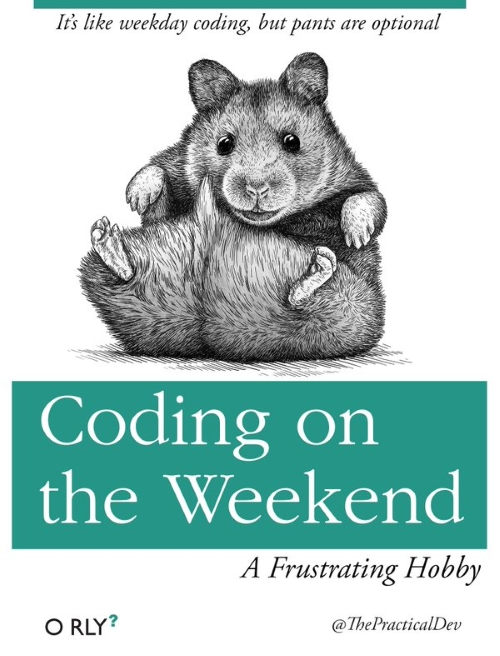

# Hi there! 


  &nbsp;

My name is Josh Caplin and I'm a software engineer living in Arizona :cactus:. My current focus is full-stack web development - mainly with React, .NET Core and related technologies.

&nbsp;&nbsp;&nbsp;&nbsp;&nbsp;&nbsp;&nbsp;[](https://www.linkedin.com/in/joshcaplin/)  &nbsp;&nbsp;&nbsp;&nbsp;[](https://www.twitter.com/joshcaplin)

### :metal: About me
  - 10+ years of experience as a software engineer - architecting & designing applications, building new systems, and enhancing existing systems.
  - Website:  [www.joshcaplin.dev](https://www.joshcaplin.dev)&nbsp;&nbsp;&nbsp;&nbsp;&nbsp;&nbsp;
  - Blog:   [joshcaplin.wordpress.com](https://joshcaplin.wordpress.com)&nbsp;&nbsp;
&nbsp;

### :sunrise_over_mountains: Hobbies
- Skiing, disc golf, hiking & building things like a home arcade system and a cryptocurrency mining rig. 
&nbsp;

### :dart: Future goals
- I'd like to help others get into software development.  It seems like a common concern is that people don't know how to get started, or no one will hire them without IT experience so I'd like to share how I got past those roadblocks. 
&nbsp;

### :eyes: Nerdy stuff...  
```javascript
const josh = {
    codingLanguages: ['JavaScript', 'TypeScript', 'C#', 'and some obsolete ones I`m embarrassed to admit'],
    frameworksLibraries: ['React', 'Angular', 'Vue', 'jQuery', '.NET Core', 'ASP.NET', 'Bootstrap', 'Jest', ],
    cloud: ['Azure', 'AWS'],
    miscTechnologies: ['Redux', 'OAuth/OIDC', 'Web API', 'Entity Framework', 'unit testing', 'RESTful services', 'SQL', 'git', 'Node', 'Fluent UI', 'Sass', 'Less'],
    architecture: ['Single page applications', 'Microservices', 'Serverless architecture', 'Progressive web applications', 'MVC'],
    currentSideProjects: ['Publishing a drag & drop npm library', 'Working on a IoT kegerator'],
    askMeAbout: ['web dev', 'coding', 'tech', 'cryptocurrency', '3d printing'],
    funFact: 'I tried brewing beer for a while... it`s much harder than it looks!',
};
```
&nbsp;

### :book: Favorite books

<hr />

<hr />

<hr />


&nbsp;
&nbsp;
**Page Visits:** 
